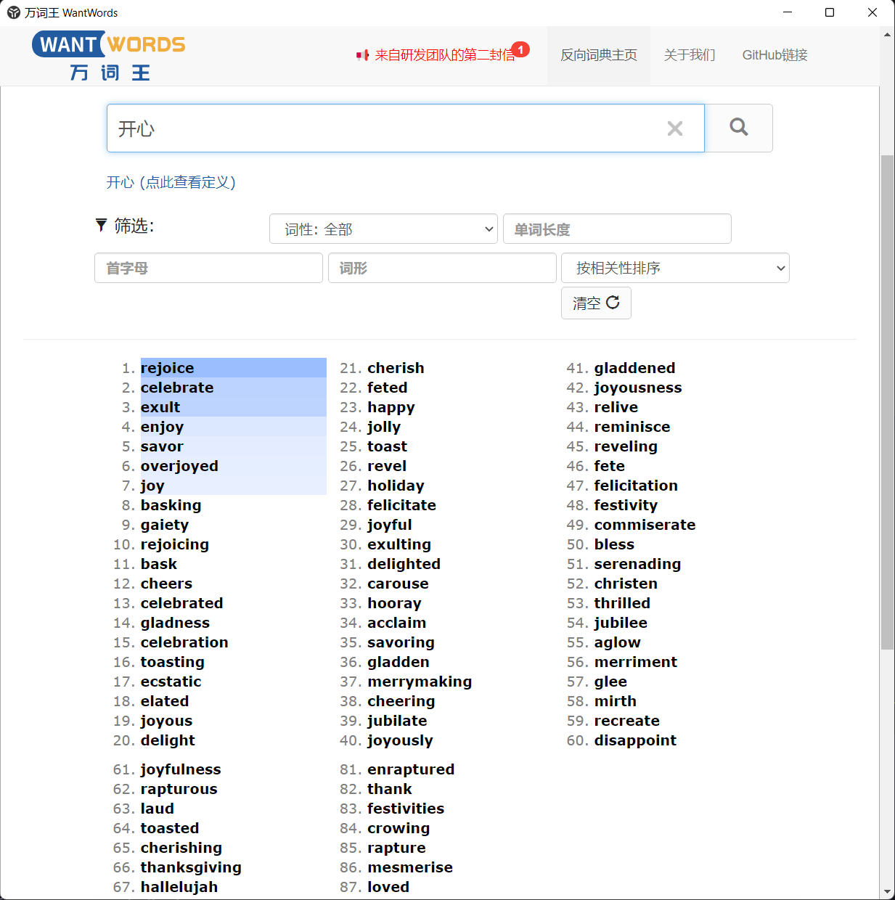

# WWUtools

WantWords Utools 插件， https://wantwords.thunlp.org/

## 使用方法

0. 了解[万词词典](https://wantwords.thunlp.org/)
1. 复制你需要进行查询的词语
2. 打开Utools，选择你需要进行的查询类型。
   查询类型有：中中(wczz)，中英(wczy)，英中(wcyz)，英英(wcyy)
3. （可选） 对你需要查询的词进行微调
4. 按下回车

## 效果截图

